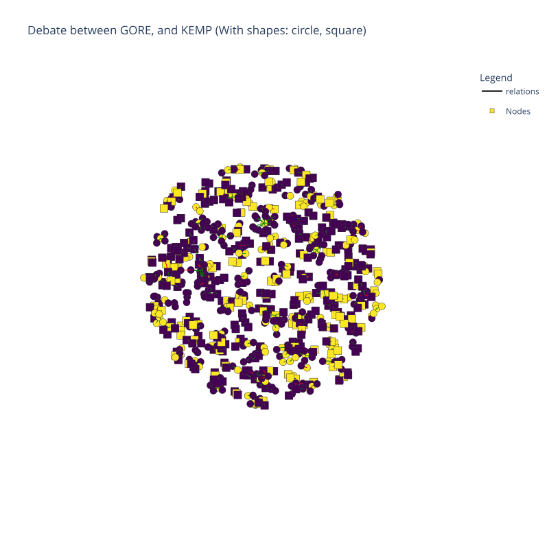

# political-debates-graph-analysis

The objective of this project is to implement knowledge embedding graph techniques on a dataset comprising 41
presidential election debates in the United States spanning from 1960 to 2016. This dataset has been meticulously
annotated, with a specific focus on dissecting argument components (referred to as _premises_ and _claims_) and
delineating argument relations (namely, _support_ , _attack_ and _equivalence_).
This dataset can be explored with the tool DISPUTool publicly available [here](https://3ia-demos.inria.fr/disputool/).
More information about the dataset can be found in
this [GitHub repo](https://github.com/ElecDeb60To16/Dataset/tree/master).

Previously, the classification of argument relations, including support, attack, and equivalence, primarily relied on
deep learning techniques. This project endeavors to explore an innovative approach by considering the structural
attributes of constructed graphs to enhance the automated classification of argument relations.

## EXPLORATION DATA ANALYSIS

All the code for the exploration data analysis of the dataset can be found in the corresponding folder:
`visualization/graph_visualization.ipynb` - 

| **Statistics**             | **num** | 
|:---------------------------|:-------:|
| Debates                    |   44    |
| Total speakers             |   64    |
| Edges                      |  26230  |
| Nodes                      |  38667  |
| Claim node                 |  25078  |
| Premise node               |  13589  |
| Support Nodes Relations    |  21689  |   
| Attack Nodes Relations     |  3835   |
| Equivalent Nodes Relations |   706   |

_Example graph of debate between Gore and Kemp_:

## BENCHMARKING

The dataset was tested against 10 state of the art KGE models using the [PyKEEN](https://github.com/pykeen/pykeen)
library
with increasing level of noise (0, 0.05, 0.1, 0.2, 0.3, random) to simulate the noise produced by the annotator on the
dataset.

* _TransE_
* _DistMult_
* _ComplEx_
* _HolE_
* _ConvE_
* _RotatE_
* _PairRE_
* _AutoSF_
* _BoxE_
* _TransH_

### DATASET

Original dataset are available
on [OneDrive](https://unice-my.sharepoint.com/:f:/g/personal/deborah_dore_unice_fr/EiOstyJcCJBBhLjMnF2DNVIBwc7s0IzaBgDFeoNhSqYU-Q?e=7S1t23)

### REPRODUCIBILITY

#### Environment
* Python 3.9
* Nvidia V100 32 Gb
* [requirements.py](benchmarking/requirements.txt)

#### Data Processing Script
`benchmarking/utils/dataset_utils.py`
#### Training/Hyperparameter tuning Script
`benchmarking/training.py`
#### Evaluation Script
`benchmarking/evaluation.py`
`benchmarking/utils/metrics.py`
`benchmarking/utils/evaluation_utils.py`

## ACKNOWLEDGEMENT
This work was supported by the French government, through the UCAJEDI Investments in the Future project managed by the
National Research Agency (ANR) under reference number ANR-15-IDEX-01. The authors are grateful to the OPAL
infrastructure and the Université Côte d’Azur’s Center for High-Performance Computing for providing resources and
support.

## LICENSE
Our code and data are licensed with a [MIT License](LICENSE).